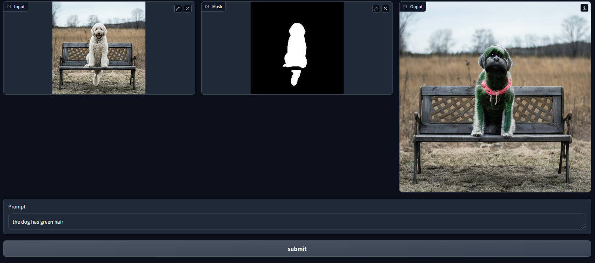

# Stable-Diffusion-Inpainting-with-SAM


In this application of Inpainting we leverage the power of SAM ( Segment Anything Model ) with Stable diffusion.

When the input image is uploaded and clicked on the particular area where we want to inpaint the SAM generates a mask for that particular area and we write down the prompt desciption in the below text box and when clicked on submit the output inpainting image is generated.


## Example
----


## How to run
After installing all the dependencies for [SAM](https://github.com/facebookresearch/segment-anything) run command

```pip install -r requirements.txt```

Try running

```python3 app.py```
